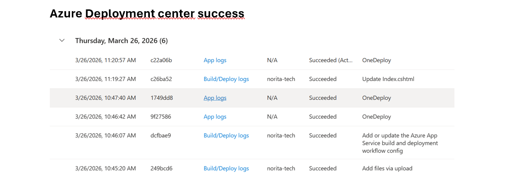
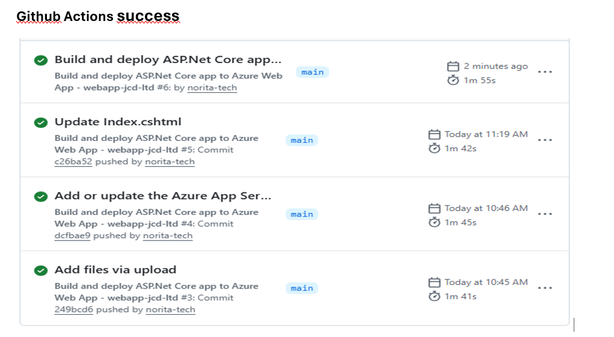
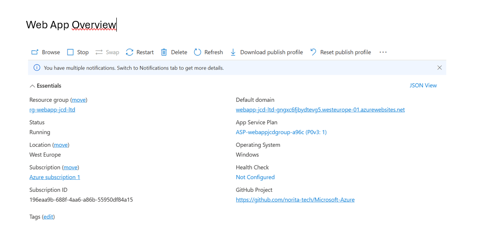
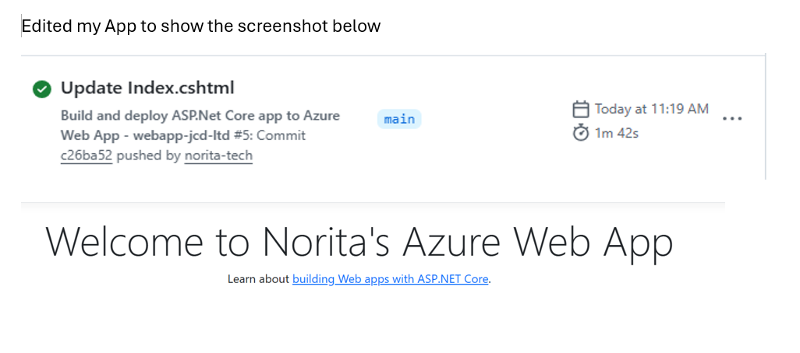
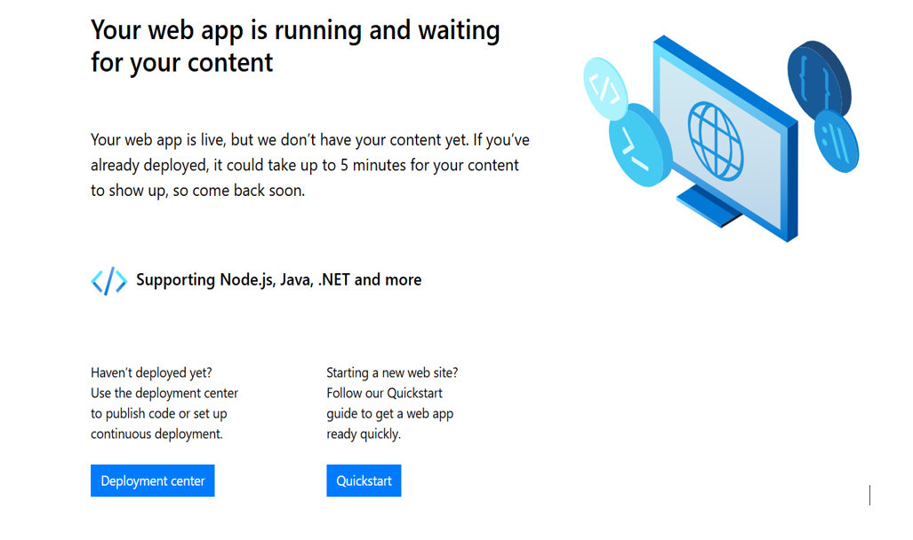

#  Azure Web App Deployment with GitHub Actions 

This project demonstrates a complete cloud engineering workflow: building a .NET web application, hosting it on GitHub, automating deployments with GitHub Actions, and running the application live on Azure App Service.  
It showcases real-world skills in CI/CD, Azure infrastructure, troubleshooting, and cloud deployment.

##  Live Application
 **URL:** webapp-jcd-ltd-gngxc6fjbydtevg5.westeurope-01.azurewebsites.net

##  Tech Stack

- **.NET 8 Razor Web App**
- **C#**
- **Git & GitHub**
- **GitHub Actions (CI/CD)**
- **Azure App Service**
- **Azure Portal**

##  Project Structure

MyWebApp/
│   MyWebApp.csproj
│   Program.cs
│   appsettings.json
│
├── Pages/
├── wwwroot/
├── Properties/
└── .github/workflows/azure-webapps.yml

##  Architecture Diagram
                          ┌──────────────────────────┐ 
                          │        GitHub Repo        │
                          │  (.NET Source Code + Git) │
                          └──────────────┬────────────┘
                                         │ Push
                                         ▼
                          ┌──────────────────────────┐
                          │      GitHub Actions       │
                          │  CI/CD Build & Deploy     │
                          └──────────────┬────────────┘
                                         │ Deploy to Azure
                                         ▼
        ┌──────────────────────────────────────────────────────────────┐
        │                        Azure App Service                     │
        │  - Hosts the .NET Web App                                    │
        │  - Runs latest deployed version                              │
        │  - Provides public HTTPS endpoint                            │
        └───────────────┬──────────────────────────────────────────────┘
                        │ Public URL
                        ▼
                ┌──────────────────────────┐
                │     End User Browser     │
                │  Accesses Live Web App   │
                └──────────────────────────┘

##  Screenshots

###  1. Deployment Success  

###  2. GitHub Actions Success  

###  3. Azure Web App Overview  

###  4. Edited Web App Version  

###  5. Web App URL Overview  

##  What I Learned

- How to create and structure a .NET web application  
- How to use Git and GitHub for version control  
- How to configure GitHub Actions for automated CI/CD  
- How to deploy applications to Azure App Service  
- How to troubleshoot build and deployment errors  
- How cloud workflows operate in real production environments  

##  Future Improvements

- Add a database (Azure SQL or Cosmos DB)  
- Add authentication (Microsoft Entra ID)  
- Add logging and monitoring with Azure Monitor
- Add a staging slot
- Add API endpoints  
- Build a more advanced UI  

##  Author

**Norita**  
Cloud Engineer/Cloud Administrator in training | Azure-focused | Based in Switzerland  

